# DisCoPy diagram gallery

This gallery visualizes the categorical processes implemented numerically by `markov_entropy`. The SVG files are generated from the same finite spaces, distributions, and channels used by the package.

Regenerate the gallery with:

```bash
uv sync --all-extras
uv run python examples/render_discopy_gallery.py
```

## Canonical Markov structure

| Construction | Diagram |
|---|---|
| Channel `f: X → Y` | 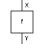 |
| Copy `X → X ⊗ X` | 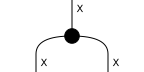 |
| Discard `X → I` | 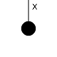 |
| Composition `g ∘ f` | 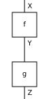 |
| Tensor `f ⊗ g` | 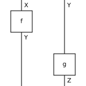 |

## Entropy as departure from determinism

The state entropy construction compares a copied sample with two independent samples.

| Actual process | Reference process |
|---|---|
| 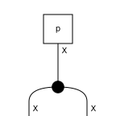 | 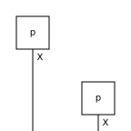 |

For a channel, it compares copying one output with copying the input and applying the channel twice.

| Actual process | Reference process |
|---|---|
| 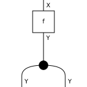 | 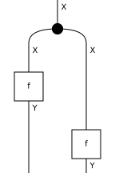 |

## Mutual information as departure from independence

A joint state is compared with the tensor product of its marginals.

| Actual process | Reference process |
|---|---|
| 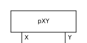 | 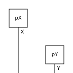 |

A two-output channel is compared with conditionally independent marginal channels sharing the copied input.

| Actual process | Reference process |
|---|---|
| 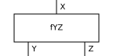 | 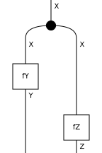 |

The diagrams are symbolic. Numerical matrices, marginals, divergences, and information values continue to be computed by `markov_entropy`.
